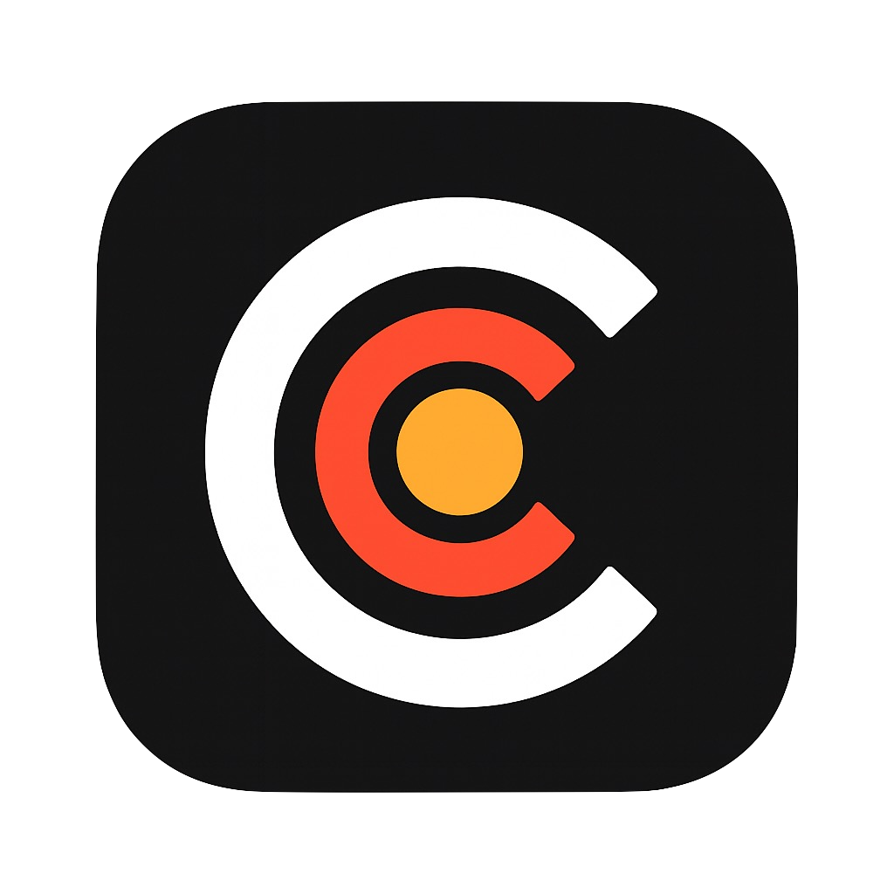

# Claimb - League of Legends Companion App

<div align="center">
  
  
  **Your personal League of Legends coach in your pocket**
  
  [](https://developer.apple.com/ios/)
  [](https://swift.org/)
  [](https://developer.apple.com/xcode/swiftui/)
  [](https://developer.apple.com/documentation/swiftdata/)
</div>

## 🎯 **What is Claimb?**

Claimb is a **local-first** League of Legends companion app designed for iPhone users who want to improve their gameplay through data-driven insights and personalized coaching. Unlike other apps that require constant internet connectivity, Claimb works offline and respects your privacy by keeping all data on your device.

### **Core Features**
- 📊 **Post-Game Analysis**: Get 3 key insights + 1 actionable drill after each match
- 🏆 **Champion Pool Guidance**: Optimize your champion selection based on meta and performance
- 📈 **Performance Tracking**: Monitor your progress with detailed metrics and trends
- 🔄 **Offline-First**: Works without internet after initial data sync
- 🎮 **iPhone-Optimized**: Designed specifically for one-handed mobile use

## 🏗️ **Architecture**

### **Technology Stack**
- **Platform**: iOS 17+ (iPhone only)
- **Language**: Swift 6
- **UI Framework**: SwiftUI
- **Data Persistence**: SwiftData
- **Networking**: URLSession with async/await
- **APIs**: Riot Games API, Data Dragon API

### **Design Principles**
- **Local-First**: All data stored locally, no backend required
- **Privacy-Focused**: No data leaves your device
- **Offline-Capable**: Full functionality without internet connection
- **Performance-Oriented**: Optimized for 60-120 second usage sessions
- **Simple & Clean**: Minimalist design following Apple's Human Interface Guidelines

## 📱 **Current Features**

### **✅ Implemented (Phase 1-3)**
- **Account Management**: Login with Riot ID (Summoner Name + Tag)
- **Match History**: View last 5 matches with detailed statistics
- **Champion Data**: Complete champion database loaded (171 champions)
- **Performance Metrics**: KDA, CS/min, Vision Score, and more
- **Offline Caching**: 50 matches cached per summoner
- **Background Refresh**: Automatic data updates every 20 minutes
- **Region Support**: EUW, NA, EUNE

### **🔄 Known Issues**
- **Champion Display**: "Unknown Champion" showing in match cards
- **Match Results**: "Unknown" displaying instead of "Victory"/"Defeat"

### **🔄 In Development**
- **AI Coaching**: Post-game analysis with personalized insights
- **Champion Pool Optimization**: Meta-based recommendations
- **Performance Analytics**: Trend analysis and improvement suggestions
- **Premium Features**: Advanced coaching and unlimited analysis

## 🚀 **Getting Started**

### **Prerequisites**
- macOS 14+ with Xcode 15+
- iOS 17+ device or simulator
- Riot Games API key (for development)

### **Installation**
1. Clone the repository:
   ```bash
   git clone https://github.com/yourusername/claimb.git
   cd claimb
   ```

2. Open the project in Xcode:
   ```bash
   open Claimb.xcodeproj
   ```

3. Configure your Riot API key in build settings:
   - Add `RIOT_API_KEY` to your build settings
   - Never commit API keys to version control

4. Build and run on your device or simulator

### **First Launch**
1. Enter your Riot ID (Summoner Name + Tag)
2. Select your region (EUW, NA, or EUNE)
3. Tap "Login" to sync your match data
4. Wait for champion data to load (one-time setup)
5. Explore your match history and performance metrics

## 📊 **Data Models**

### **Core Entities**
- **Summoner**: Player identity and account information
- **Match**: Game metadata and team composition
- **Participant**: Individual player performance data
- **Champion**: Static champion data from Data Dragon
- **Baseline**: Performance benchmarks for coaching analysis

### **Key Metrics Tracked**
- **Combat**: KDA, Damage Dealt/Taken, Kill Participation
- **Economy**: Gold per Minute, CS per Minute, Gold Share
- **Vision**: Vision Score, Ward Placement, Control Wards
- **Objectives**: Dragon/Baron participation, Tower damage
- **Challenges**: Riot's performance challenge data

## 🔧 **Development**

### **Project Structure**
```
Claimb/
├── Models/           # SwiftData models
├── Services/         # API clients and business logic
├── Views/            # SwiftUI views
├── Utils/            # Utilities and helpers
└── Assets.xcassets/  # App icons and images
```

### **Key Services**
- **RiotHTTPClient**: Handles all Riot API communication
- **DataDragonService**: Manages static game data
- **DataManager**: Central data orchestration and caching
- **RateLimiter**: API rate limiting and request queuing

### **Testing**
The app includes comprehensive test views for development:
- **RiotAPITestView**: Interactive API testing
- **DataDragonTestView**: Champion data verification
- **SwiftDataTestView**: Database operations testing
- **ChampionTestView**: Champion lookup debugging

## 🌐 **API Integration**

### **Riot Games API**
- **Account-v1**: Player account lookup
- **Summoner-v4**: Summoner profile data
- **Match-v5**: Match history and details
- **League-v4**: Ranked information

### **Data Dragon API**
- **Champion Data**: Names, titles, and metadata
- **Champion Icons**: High-resolution champion images
- **Version Management**: Patch-specific data locking

### **Rate Limiting**
- **Personal API Key**: 100 requests per 2 minutes
- **App Rate Limiting**: 1.2 second delay between requests
- **Caching Strategy**: URLCache for automatic response caching

## 🔒 **Privacy & Security**

### **Data Handling**
- **Local Storage**: All data stored on device using SwiftData
- **No Backend**: No data sent to external servers
- **API Keys**: Stored securely in iOS Keychain
- **Offline Mode**: Full functionality without internet

### **Permissions**
- **Network**: Required for API calls and data sync
- **Background App Refresh**: Optional for automatic updates

## 📈 **Roadmap**

### **Phase 4: AI Coaching (Next)**
- [ ] OpenAI integration for match analysis
- [ ] Personalized coaching insights
- [ ] Actionable improvement drills
- [ ] Performance trend analysis

### **Phase 5: Champion Pool Optimization**
- [ ] Meta-based champion recommendations
- [ ] Pool synergy analysis
- [ ] Counter-pick suggestions
- [ ] Role-specific guidance

### **Phase 6: Advanced Analytics**
- [ ] Performance dashboards
- [ ] Goal setting and tracking
- [ ] Comparison with peer performance
- [ ] Detailed match breakdowns

### **Phase 7: Premium Features**
- [ ] StoreKit 2 integration
- [ ] Unlimited analysis quota
- [ ] Advanced coaching features
- [ ] Export and sharing capabilities

## 🤝 **Contributing**

We welcome contributions! Please see our [Contributing Guidelines](CONTRIBUTING.md) for details.

### **Development Setup**
1. Fork the repository
2. Create a feature branch
3. Make your changes
4. Add tests for new functionality
5. Submit a pull request

### **Code Style**
- Follow Swift API Design Guidelines
- Use SwiftUI best practices
- Maintain 100-300 LOC per service file
- Include comprehensive error handling
- Add logging for debugging

## 📄 **License**

This project is licensed under the MIT License - see the [LICENSE](LICENSE) file for details.

## 🙏 **Acknowledgments**

- **Riot Games** for providing the League of Legends API
- **Data Dragon** for static game data
- **Apple** for SwiftUI and SwiftData frameworks
- **Community** for feedback and suggestions

## 📞 **Support**

- **Issues**: [GitHub Issues](https://github.com/yourusername/claimb/issues)
- **Discussions**: [GitHub Discussions](https://github.com/yourusername/claimb/discussions)
- **Email**: support@claimb.app

---

<div align="center">
  <p>Made with ❤️ for the League of Legends community</p>
  <p>© 2024 Claimb. All rights reserved.</p>
</div>
